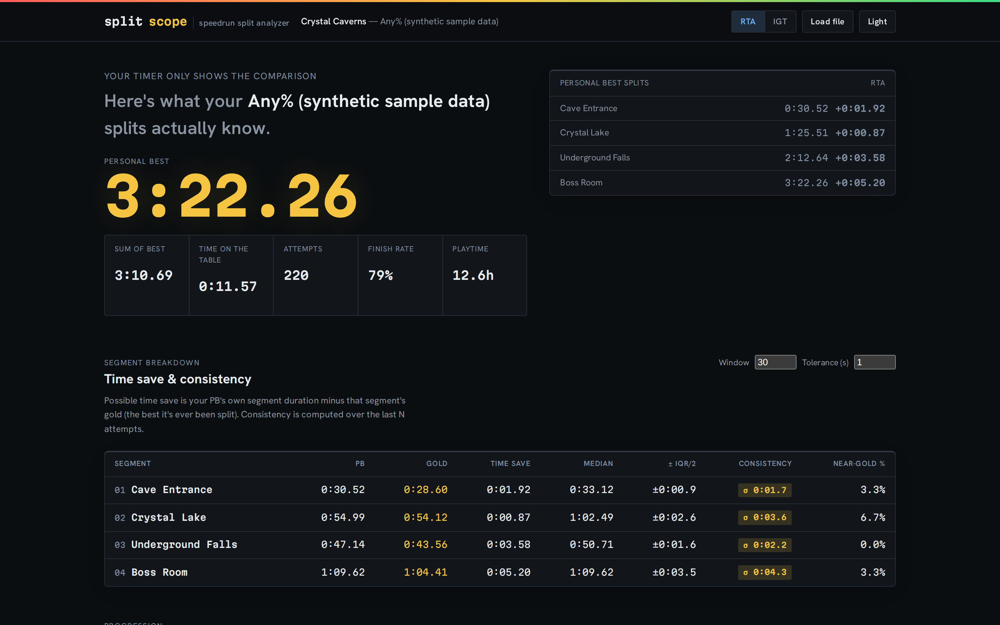

# splitscope

**Your LiveSplit file knows more than your timer shows.**

[](LICENSE)
[](https://antonsoo.github.io/splitscope/)



LiveSplit's `.lss` file records **every segment time of every attempt you've
ever made**. The timer on your screen shows you one number: the delta
against your current comparison. It never tells you which segment is
actually costing you the most time, whether your "inconsistent" segment is
inconsistent or you're imagining it, where your runs actually die, or what
your realistic odds of a PB are tonight. That data all exists — LiveSplit
just doesn't show it to you. splitscope reads the same file and answers
those questions, entirely in your browser.

## Contents

- [Quickstart](#quickstart)
- [Features](#features)
- [Usage](#usage)
- [How it works](#how-it-works)
- [Accuracy and limitations](#accuracy-and-limitations)
- [Contributing](#contributing)
- [License](#license)

## Quickstart

The fastest way to use splitscope is the hosted build — nothing to install:
**<https://antonsoo.github.io/splitscope/>**. Drop in your `.lss` file, or
click "Load sample" to try it with synthetic data first.

To run it from source:

```sh
git clone https://github.com/antonsoo/splitscope.git && cd splitscope
npm install
npm run dev
```

Open the URL Vite prints (`http://localhost:5173/splitscope/` by default).

## Features

- **Parses LiveSplit `.lss` files** — game/category, offset, full attempt
  history, per-segment PB/gold/history, both RealTime and GameTime — verified
  against LiveSplit's own reference parser, with graceful fallback back to
  format `1.0.0.0`. See [`docs/format.md`](docs/format.md).
- **Segment breakdown**: PB, gold, and possible time save per segment (your
  PB's own segment duration minus that segment's gold), plus consistency
  (median, IQR, standard deviation, and % of recent attempts within a
  tolerance of gold), heatmapped in one table.
- **Delta-vs-PB progression** across every finished attempt, in LiveSplit's
  own gold/green/red delta language, with your PB's improvement history
  marked out.
- **Reset analysis**: a survival curve (what share of attempts reach each
  segment) and a "where do runs die" histogram.
- **Per-segment time distributions** as strip plots, so "inconsistent" is a
  picture, not a guess, plus each segment's full **gold history** — a
  step-chart of every time a new record was set, across the whole run.
- **PB odds** — the one number LiveSplit can't show you: a Monte Carlo
  simulation of your probability of beating your PB, on the next attempt or
  within the next *K*, with a confidence interval and its assumptions stated
  up front. This is the feature that doesn't exist anywhere else.
- **Export** a Markdown summary (for Discord, a wiki, a PR) or a PNG share
  card, both generated locally.
- Everything runs client-side. No accounts, no analytics, no upload — open
  the network tab and check.

## Usage

1. Open the [live demo](https://antonsoo.github.io/splitscope/) (or run
   locally).
2. Drop in your `splits.lss` (it lives in your LiveSplit install folder,
   usually wherever you pointed "Edit Splits → Save As"), or click
   **Load sample** to try synthetic data first.
3. Toggle **RTA / IGT** to switch between RealTime and GameTime, if your
   splits have both.
4. Scroll to **PB odds** and adjust the recent-form window, look-ahead, and
   simulation count live.
5. **Export → Download Markdown summary** or **Download PNG card** to share.

### Example output

Running splitscope's Markdown export against this repo's own committed
sample file (`examples/crystal-caverns-any.lss`, 220 synthetic attempts)
produces, byte for byte:

```markdown
# Crystal Caverns — Any% (synthetic sample data)

Generated by [splitscope](https://antonsoo.github.io/splitscope/) · timing method: RealTime · 220 attempts · 12.6h played

## Headline

- **PB:** 3:22.26
- **Sum of best:** 3:10.69
- **Total possible time save:** 0:11.57
- **Finished attempts:** 173 / 220 (78.6%)
- **Where runs die most:** Boss Room (20 resets)

## Biggest time-save opportunities

| Segment | Possible save |
| --- | ---: |
| Boss Room | 0:05.20 |
| Underground Falls | 0:03.58 |
| Cave Entrance | 0:01.92 |
| Crystal Lake | 0:00.87 |

## PB odds (Monte Carlo)

- **P(next attempt beats PB):** 0.45% (95% CI 0.37%–0.55%)
- **P(≥ 1 PB in next 50 attempts):** 20.2%
- **Expected attempts to next PB:** 222
- Based on 20,000 simulated attempts, resampled from the last 30 attempts. Assumes independent segments and a stationary recent-form window — see the app for full assumptions.
```


## How it works

### Parsing

`.lss` is XML. Every duration is a serialized .NET `TimeSpan`
(`00:01:23.4560000`, or `1.23:34:56.7890000` for multi-day durations), and
the element shapes have changed several times across LiveSplit's history —
`SplitTimes` didn't exist before format `1.3.0`, `RealTime`/`GameTime`
weren't split into their own child elements before `1.4.1`, and
`AttemptHistory` (with real timestamps) replaced the older `RunHistory`
(just an id and a time) at `1.5.0`. splitscope's parser
(`src/core/parser.ts`) is verified line-by-line against LiveSplit's own
parser, **livesplit-core**'s `src/run/parser/livesplit.rs`, not
reconstructed from sample files — see [`docs/format.md`](docs/format.md)
for the full citation and a walkthrough of every version gate, and
`tests/parser.test.ts` for fixtures spanning `1.0.0.0` to `1.8.1`, including
empty history, skipped splits, and missing GameTime.

A **split time** (a comparison like "Personal Best") is cumulative time
since the run started; a **segment time** (gold, segment history) is that
segment's own duration. Getting this backwards would silently corrupt every
statistic in the app, so it's called out explicitly in code and in
`docs/format.md`.

### Time-save and consistency

- *Possible time save* per segment = (this segment's PB duration) − (this
  segment's gold), where PB duration is the difference between consecutive
  cumulative PB split times.
- *Consistency* is computed over the last *N* attempts (configurable):
  median, interquartile range, sample standard deviation, and the percent of
  attempts within a configurable tolerance of gold. The consistency
  heatmap's tiers use **coefficient of variation** (stdDev / median), not a
  fixed number of seconds, so a 12-second segment and a 4-minute segment are
  judged on the same scale.
- Skipped splits (LiveSplit records a segment-history entry with no time)
  are excluded from these statistics rather than treated as zero.

### Reset analysis

For each attempt, splitscope finds the furthest segment with *any*
segment-history entry (timed or skipped) and treats that as how far the
attempt got. An attempt is a "finish" if its `AttemptHistory` entry has an
overall RealTime recorded — that's the wall-clock completion signal
LiveSplit itself uses; the format doesn't have an explicit "finished" flag.
The survival curve is the share of attempts that reached each segment; the
death histogram counts, per segment, how many non-finishing attempts had
that segment as their furthest.

### PB odds (Monte Carlo)

A simulated attempt walks the segments in order. At each one it first rolls
that segment's **empirical reset hazard** — historically, how often an
attempt that reached this segment died during it — and if it survives, draws
a duration by **bootstrap resampling** (sampling with replacement) from that
segment's own recent `SegmentHistory` times. Run tens of thousands of times,
this gives:

- P(a single future attempt both finishes and beats PB), with a 95% Wilson
  score confidence interval on the Monte Carlo proportion (Wilson rather
  than the simpler Wald interval because PB probabilities here are often
  under 1%, where Wald's coverage is known to degrade);
- P(at least one PB in the next *K* attempts), via `1 − (1 − p)^K` — a
  closed-form combination of the per-attempt estimate under an independence
  assumption, not a second, nested simulation;
- expected attempts to the next PB, as `1 / p` (the geometric distribution's
  mean).

This deliberately composes two well-known, auditable techniques
(bootstrap + hazard simulation) rather than fitting a black-box model, and
it says so on the page: the panel's "How this is modeled" disclosure states
every assumption (independence between segments, a stationary recent-form
window, constant hazard, independent attempts) plainly, because a
probability without its assumptions is a number you shouldn't trust.

`tests/montecarlo.test.ts` checks the simulator against two closed-form
oracles rather than only against itself: a zero-variance constant-time case
(the model must give *exactly* 0 or 1, not "close to"), and independent
normal segment times, where P(total < PB) has a closed form via the normal
CDF (`normalCdf` in `src/core/stats.ts`, the Abramowitz–Stegun 7.1.26
rational approximation) — the Monte Carlo estimate is asserted within Monte
Carlo tolerance of that closed form, and its own 95% CI is asserted to
contain it.

### Performance

`GameIcon`/`Icon` (base64 images) and `AutoSplitterSettings` are stripped
from the XML text before parsing, since they're never read. On a synthetic
4.6&nbsp;MB `.lss` with realistic embedded icon sizes, that's the difference
between 86.7&nbsp;ms and 14.7&nbsp;ms per parse — a 5.9× speedup — measured
with `performance.now()`, 15-iteration average after warmup, on this
project's own dev box (14 vCPU WSL2 Linux, 48 GB RAM). The real 220-attempt
sample committed in `examples/` (149&nbsp;KB, no icons) parses in about
13&nbsp;ms on the same machine.

## Accuracy and limitations

- **PB odds is a model, not a prophecy.** It assumes segments are
  independent (a bad Segment 2 doesn't change the odds for Segment 3) and
  that your recent-form window is representative of every simulated future
  attempt (no further improvement or fatigue). Both assumptions favor
  optimism: real runs have more structure — momentum, tilt, warm-up — than
  this model does. Treat the output as "roughly this often, under these
  rules," not a guarantee.
- **The finish/reset signal is inferred**, not an explicit field in the
  format: an attempt counts as finished if it has an overall RealTime.
  This matches how LiveSplit itself behaves, but it's a design decision
  documented in `docs/format.md`, not something the spec states.
- **Consistency tiers (tight/mid/loose)** use fixed coefficient-of-variation
  cutoffs (3%, 8%) that aren't tuned per game or genre — a segment with a
  lot of legitimate route variance (multiple valid strategies) will read as
  "inconsistent" even if every individual choice was executed well.
- **Older format support** (back to `1.0.0.0`) is verified against the
  reference parser's logic and one hand-built fixture per major shape, not
  against a corpus of real old files — if you hit a real file from that era
  that doesn't parse, please open an issue with the file (see
  [`CONTRIBUTING.md`](CONTRIBUTING.md)).
- **Icons and autosplitter settings are ignored entirely** — splitscope is
  an analyzer, not a splits editor, and never writes a `.lss` file back out.
- Sample data in `examples/` is **synthetic**, generated by
  `scripts/generate-sample.ts` for a fictional game ("Crystal Caverns");
  it is not a real speedrun and every number in it is simulated.

## Contributing

See [`CONTRIBUTING.md`](CONTRIBUTING.md). In short: `npm run ci` should pass,
and changes to the parser should come with a fixture and an update to
`docs/format.md`.

## License

[MIT](LICENSE) © 2026 Anton Soloviev
